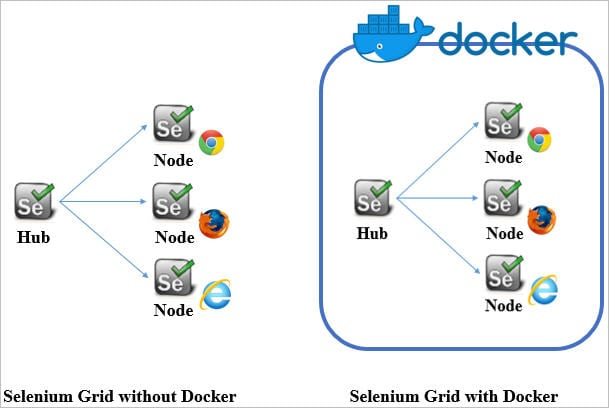
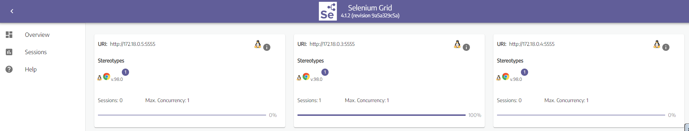
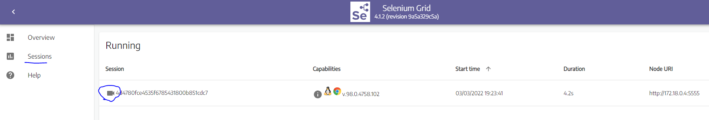
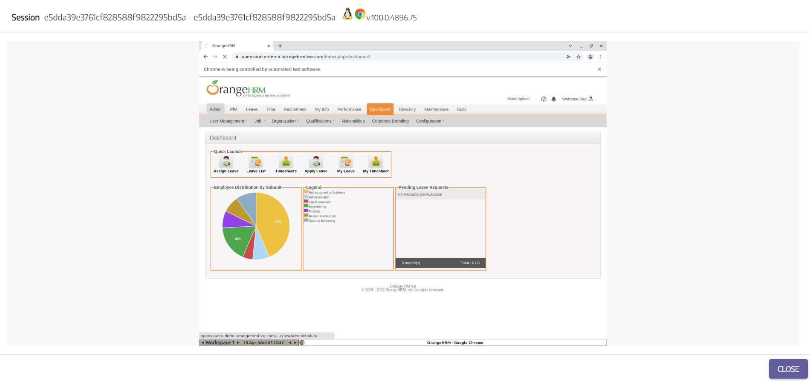

#**Automation Suite: Human Resource Management**

##**Local Run:**

Open CLI in automation-suite folder and run the below command.
**_docker-compose up --build -d_**

**Note:** It might take approx 5 minutes for the whole setup to run if ran the first time or with any code change.   

##**Selenium Test Architecture**

We run our Selenium UI tests with the help of **Selenium Grid-4** in Docker container.

**Official Sites:** 

Selenium Grid 4: **_https://www.selenium.dev/documentation/grid/_**

Docker Container for Selenium: **_https://hub.docker.com/u/selenium_**

##**Selenium Grid 4 UI and Test Run View**

Visit _**http://localhost:4444/ui/index.html#/**_ 

**Overview** --> It will display all the browser nodes registered to the Hub.

**Sessions** --> It will display all active sessions where tests are running.

**Live Test Run View** --> Click the Video Recorder Icon to view the live test run using VNC player.

